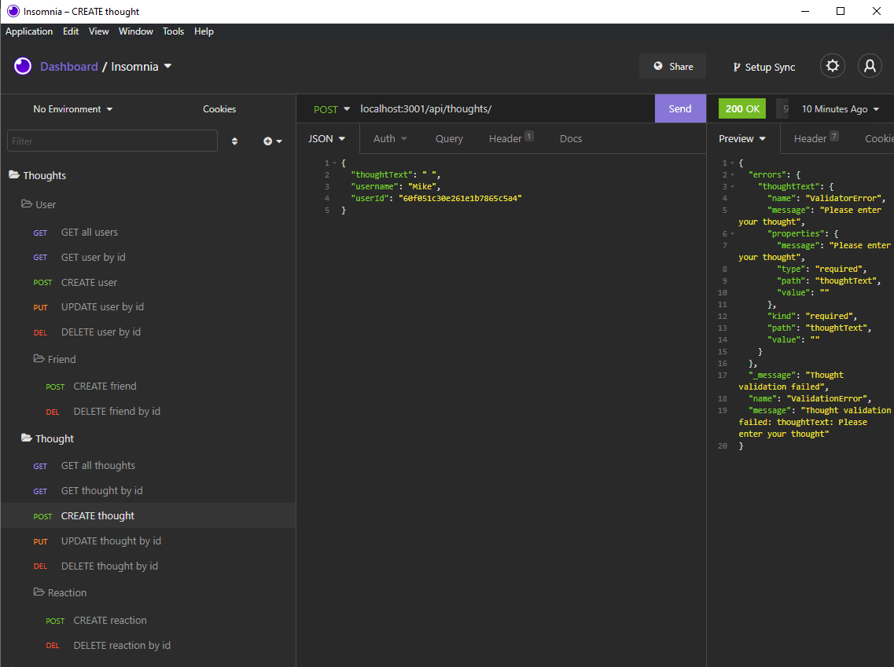
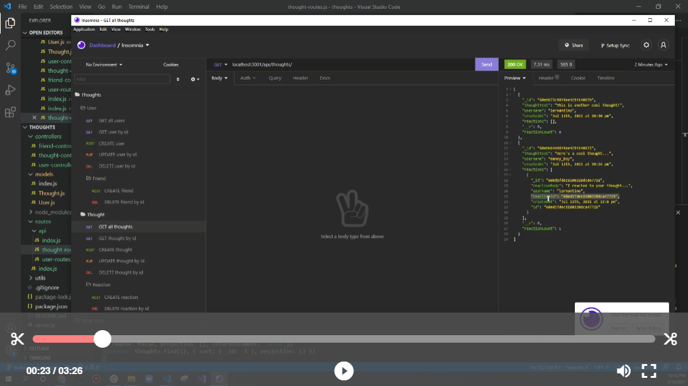

# Thoughts Back-end API

## Description 

  An API for a social network web application where users can share their thoughts, react to friends’ thoughts, and create a friend list.
  Technologies used are Node.js, Express.js, MongoDB and Mongoose Object Document Mapper(ODM). Insomnia core was used for testing the API routes for this backend application

 
  

## Installation

  - Clone/Download the project
  - From the root directory in your terminal/command line run 'npm install'
  
## Usage 
  
  - For clarity, use the links below to watch a quick tutorial on how to use:
    - Video 1: https://drive.google.com/file/d/1UV_lk87GJSAK5YdESmiptPtNEfxdbmF4/view
    - Video 2: https://drive.google.com/file/d/13rz17nRbC4cIGBKMw2ZLQcx7iu7bo9uj/view
    - Video 3: https://drive.google.com/file/d/1pii-dA2EZRzjU7ys7L-lY0bM_Wldgyh3/view
    - Video 3.1: https://drive.google.com/file/d/1ubtzOUfHJuExHYRUcyz3h5tw3W8P-eC6/view
    - Video 4: https://drive.google.com/file/d/17iD2FhH0tyrctTUWoBq3Ou3h_bmmjPaO/view
  

## Questions
  - 👋 Hi, I’m dkbaffour777
  - GitHub profile link: [github.com/dkbaffour777/](https://github.com/dkbaffour777/)
  - 📫 How to reach, email: dkbaffour777career@gmail.com
